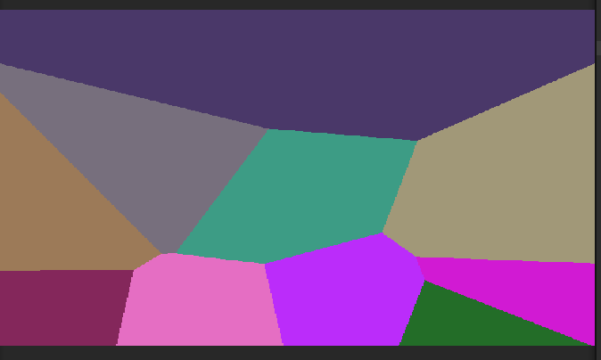
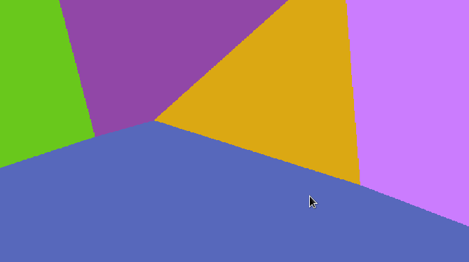
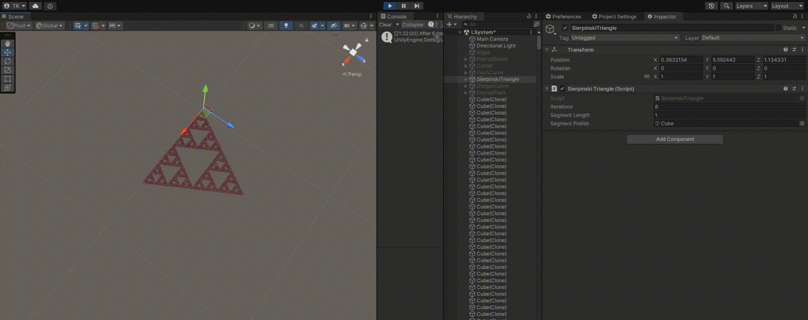
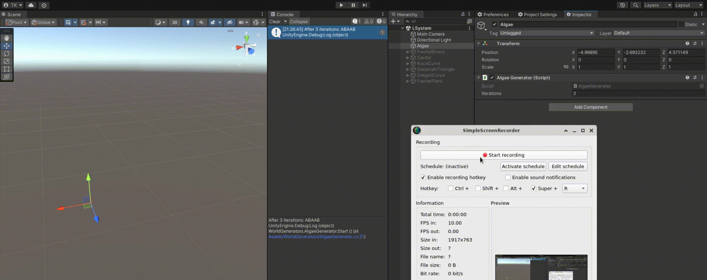

# Binary Map World Generation
Welcome!

This project is a simple implementation of a binary map world generation algorithm. 
The algorithm generates a 2D binary map of a world with road and house tiles with LOD optimization.

---
## Voronoi Diagram

  
  

---

## Grid Generation

### How it works?
### How it works

- **The algorithm generates a 2D grid of tiles with specified width and height.**
- **Road tiles are generated at intervals (e.g., 0, 3, 6, 9). Corners, crossroads, and T-junctions are dynamically generated.**
- **All other indexes are generated as house tiles.**
- **Initial grid example:**
  - 11111
  - 10001
  - 10001
  - 11111
- **The grid is then refined by selecting specific tiles to make it more natural:**
- **For instance, modifying a road tile in the center and adjusting the surrounding tiles ensures that roads are fully connected.**
- Refined grid example:
  - 11111
  - 10101 -> from 10001, after selecting it, then change its bottom index also to 1, so roads will be connected.
  - 10101  
  - 11111
- **after generating a grid, then add select a tile in the grid to make it more natural**
- **that's how the grid is generated.**

  

---

# Fractal Generation with L-systems

---

This project explores the generation of fractal shapes using L-systems, 
a formal grammar-based approach for creating complex patterns. For more on L-systems,
check out the [Wikipedia page](https://en.wikipedia.org/wiki/L-system).

L-systems are used here to produce various fractal shapes by recursively applying production rules to an initial axiom. Each fractal has unique rules, variables, and constants that give rise to distinct visual patterns.

---

## Fractal Binary Tree

### Explanation
- **Variables**: `0`, `1`
- **Constants**: `[`, `]`
- **Axiom**: `0`
- **Rules**:
    - `1 → 11`
    - `0 → 1[0]0`

  

---

## Koch Curve

  

---

## Sierpinski Triangle

  

---

## Dragon Curve

  

---

## Fractal Plant

  

---

## Algae

  

---

## Cantor Set

### Explanation
- **Constants**: None
- **Axiom**: `A` (starting character string)
- **Rules**:
    - `A → ABA`
    - `B → BBB`

---

### Each of these fractals illustrates how simple production rules can create intricate and fascinating designs. Enjoy exploring the beauty of fractals generated through L-systems!
